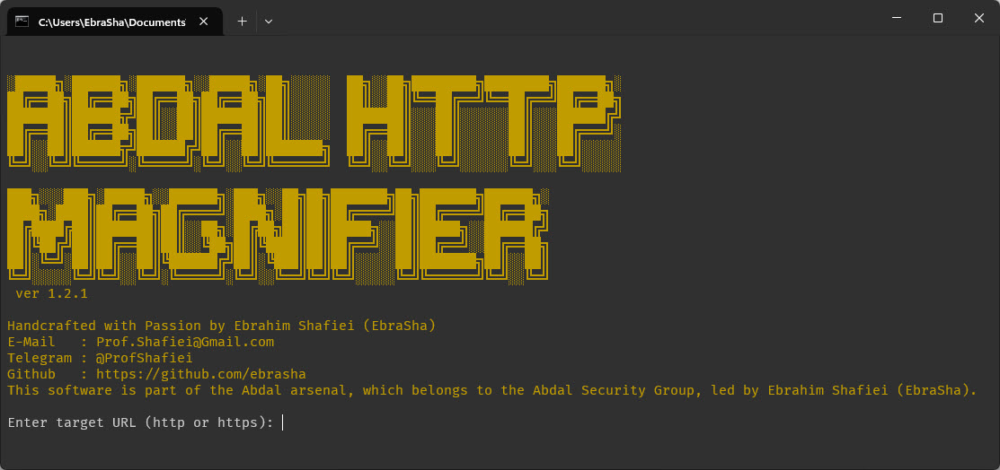

# 🔎 Abdal HTTP Magnifier

  

**Abdal HTTP Magnifier** is a high-performance reconnaissance and auditing tool crafted for cybersecurity professionals, penetration testers, and network defenders. This tool is part of the **Abdal Arsenal**, developed by **Ebrahim Shafiei (EbraSha)**. It is specifically designed to probe and enumerate HTTP methods supported by a web server, helping to identify misconfigurations, potential security risks, and WAF/CDN behaviors.

## 🎙️ Translation

[English](README.md) | [فارسی](README.fa.md)

---

## 🧠 Technical Overview

Modern web servers often support multiple HTTP methods, but not all are properly secured or even needed. Improper configuration may expose systems to attacks like Cross-Site Tracing (XST), request smuggling, and method override vulnerabilities. Abdal HTTP Magnifier uses an asynchronous scanning engine to test for the availability and behavior of:

- `GET`
- `POST`
- `PUT`
- `DELETE`
- `OPTIONS`
- `HEAD`
- `TRACE`
- `CONNECT`
- `PATCH`

The tool sends requests with a combination of custom headers to simulate evasive clients and bypass edge-layer protections such as reverse proxies or WAF/CDN layers. It includes header obfuscation through realistic browser headers and can identify hidden or restricted methods based on status code responses.

## 🎯 Key Features

- 🔍 Full enumeration of HTTP methods: `GET`, `POST`, `PUT`, `DELETE`, `OPTIONS`, `HEAD`, `TRACE`, `CONNECT`, `PATCH`
- ⚡ Asynchronous engine using `reqwest` and `tokio` for high-speed probing
- 🧩 Bypass techniques using advanced headers (`X-Forwarded-For`, `Via`, etc.)
- 🌐 HTTP/HTTPS support with certificate ignoring
- 🎨 Beautiful and informative colored CLI output
- 📡 Detects CDN/WAF interferences

## 🐛 Reporting Issues
If you encounter any issues or have configuration problems, please reach out via email at Prof.Shafiei@Gmail.com. You can also report issues on GitLab or GitHub.

## ❤️ Donation
If you find this project helpful and would like to support further development, please consider making a donation:
- [Donate Here](https://alphajet.ir/abdal-donation)

## 🤵 Programmer
Handcrafted with Passion by **Ebrahim Shafiei (EbraSha)**
- **E-Mail**: Prof.Shafiei@Gmail.com
- **Telegram**: [@ProfShafiei](https://t.me/ProfShafiei)

## 📜 License
This project is licensed under the GPLv2 or later License. 